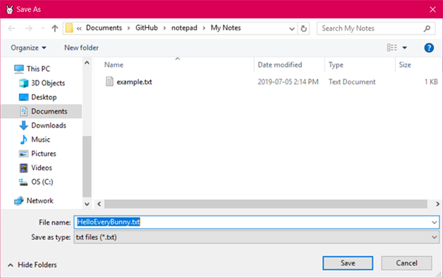

## baby notepad 

A first attempt at a desktop application. Made with Visual Studios 2017 and C#. Inspired by Sanrio stationary of my youth, *baby notepad* is a colourful nod to my love affair with anything cute and frivolous. 

  

###### The bunny is [Glenda](https://9p.io/plan9/glenda.html) of Bell Studio's Plan 9. Glenda was drawn by the talented [Renée French](http://www.reneefrench.com/).
  

  

  

