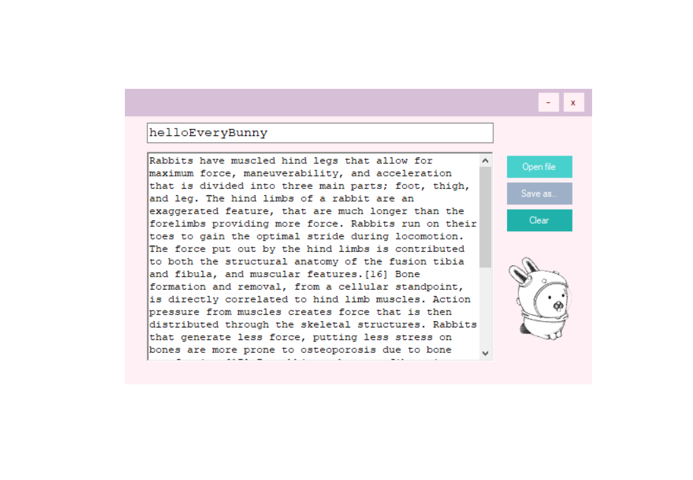
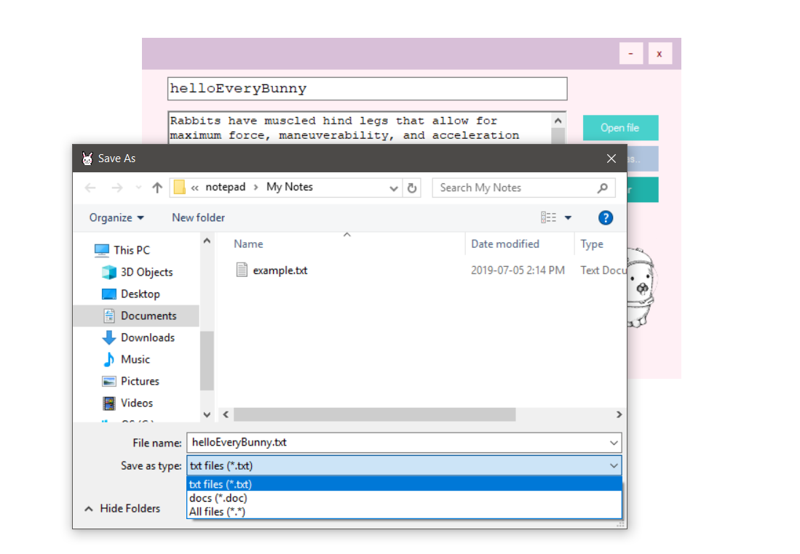

## baby notepad 

A first attempt at a desktop application. Made with Visual Studios 2017, .NET Frameworkand C#. Inspired by Sanrio stationary of my youth, *baby notepad* is a colourful and gaudy nod to childhood nostalgia, but mostly it's a bare bones text editor in a pastel pink. 

###### The bunny illustration is [Glenda](https://9p.io/plan9/glenda.html) of Bell Studio's Plan 9. Glenda was drawn by the talented [Renée French](http://www.reneefrench.com/).
  
